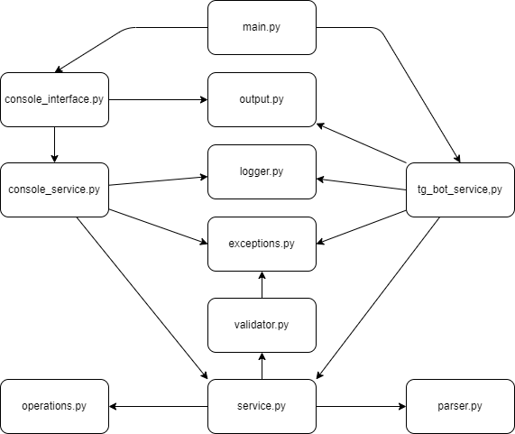

# Калькулятор
Это учебный проект приложения с функционалом калькулятора.
>Задачи:
> - Создать консольное приложение для математических операций с вещественными и комплексными числами без использования 
> встроенной функции `eval()`.
> - Создать собственную систему логирования для приложения.
> - Создать Телеграмм Бота использующего функционал приложения.

## Возможности
Приложение запрашивает выражение. Выражение может быть либо с комплексными числами либо с рациональными. \
После ввода:
1. Происходит определение типа чисел.
2. Проверяется правильность расстановки в выражении чисел и знаков.
3. Последовательно вычисляется ответ с правильным приоритетом математических операторов.
4. Выводится каждый шаг вычисления выражения.

**Рациональные числа**

Для рациональных чисел поддерживаются операции: \
'+' - сложение \
'-' - вычитание \
'/' - деление \
'*' - умножение \
'$' - целочисленное деление \
'%' - остаток от деления \
'^' - возведение в степень

Пример выражения с рациональными числами: \
((9 + 5) / (4 + 3)) ^ 2 - 10

Вывод: \
((9 + 5) / (4 + 3)) ^ 2 - 10 \
(14.0 / (4 + 3)) ^ 2 - 10 \
(14.0 / 7.0) ^ 2 - 10 \
2.0 ^ 2 - 10 \
4.0 - 10 = -6.0

**Комплексные числа**

Для комплексных чисел поддерживаются операции: \
'+' - сложение \
'-' - вычитание \
'/' - деление \
'*' - умножение

Для комплексных чисел поддерживаются только бинарны операции (выражение должно состоять только из двух чисел). \
Пример выражения с комплексными числами: \
(7.85+8j) + (5-7.34j)

Вывод: \
(7.85+8j) + (5-7.34j) = (12.85+0.6600000000000001j)

## Запуск

>Все необходимые сторонние библиотеки и их версии указаны в файле *requirements.txt*.

**Запуск через консоль** \
Для запуска через консоль достаточно раскомментировать строку `console_interface.launch()` в файле *main.py*
и запустить этот файл в интерпретаторе Python.

**Запуск в Телеграмм Боте**
1. Заменить в файле *.env* `your_token` на токен бота полученный через BotFather.
2. Раскомментировать строки `import services.tg_bot_service` и `services.tg_bot_service.launch()` в файле *main.py* 
и запустить его в интерпретаторе Python.

## Структура

1. Модуль *main.py* вызывает либо *console_interface.py* для запуска консольной версии, либо *tg_bot_service.py* для 
запуска Телеграмм Бота.
2. Так как интерфейс Бота работает через API, то для него необходимо было написать только взаимодействие с логикой
приложения. Для консольного варианта необходимо было создать интерфейс и модуль *console_service.py* для взаимодействия 
с логикой.
3. Оба варианта используют один и тот же модуль логирования *logger.py*, модуль системных сообщений для вывода
пользователю *output.py* и модуль основной логики приложения *service.py*, в который передается ввод пользователя.
4. - *service.py* проверяет с помощью модуля *validator.py* правильность введенного выражения.
   - Если выражение неверное, то *validator.py* обращается к модулю *exceptions.py* для возбуждения соответствующих
   исключений
   - Если выражение верное, то *service.py* обращается к модулю *parser.py* для разделения ввода на логические элементы.
   - *service.py* сопоставляет логические элементы с действиями которые необходимо с ними совершить из модуля
   *operations.py*, а затем применяет их.
5. Результат возвращается пользователю. Если возникла проблема с правильностью ввода или нештатная проблема,
то соответствующий сервис (*tg_bot_service.py* или *console_service.py*) обращается к модулю *exceptions.py*
для определения возбужденных исключений, и сообщает пользователя об ошибке.